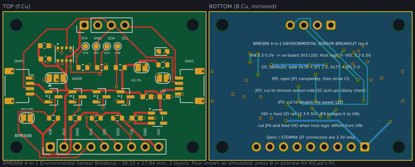

# BME688 4-in-1 Environmental Sensor Breakout

A KiCad 10 design for a host-agnostic breakout board around the **Bosch BME688**
(gas/VOC, humidity, pressure, temperature, LGA-8). It brings the sensor out on a
0.1" header that works with any I2C or SPI microcontroller at 3.3–5.5 V logic,
plus two Qwiic / STEMMA QT connectors for daisy-chaining on the 3.3 V side.



## A note on the part number

The request was for a "BLE688". No manufacturer sells a part by that name — it
does not appear in Bosch's, Nordic's, Fanstel's, Raytac's, EBYTE's or MOKO's
catalogues, nor in distributor search. The intended part was confirmed as the
Bosch **BME688**, which is what this design uses. If you actually wanted a
Bluetooth module, this is the wrong board and none of it carries over.

KiCad 10 ships a `Sensor:BME680` symbol but no BME688. The two parts are pin- and
package-compatible (Bosch LGA-8, 3.0 × 3.0 × 0.93 mm, identical pin assignment),
so `lib/BME688_Breakout.kicad_sym` restates the reviewed BME680 symbol as a
BME688 with the correct datasheet and description. The land pattern is KiCad's
own reviewed `Package_LGA:Bosch_LGA-8_3x3mm_P0.8mm_ClockwisePinNumbering`
(0.5 × 0.525 mm pads on 0.8 mm pitch), unmodified.

## Board

| | |
|---|---|
| Size | 38.10 × 27.94 mm (1.5" × 1.1") |
| Layers | 2, 1.6 mm FR4, B.Cu is a solid GND pour |
| KiCad | 10 (`kicad_sch` 20250901, `kicad_pcb` 20250907) |
| Input | 2.5–5.5 V on `VIN` → on-board AP2112K-3.3 LDO |
| Host logic | 3.3–5.5 V, set by `VIO`, level shifted on all four signals |
| Interfaces | I2C (default, 0x76) or SPI |
| Mounting | 4 × M2 (2.2 mm) at the corners |
| Min track / clearance | 0.25 mm / 0.20 mm (0.4 mm on power nets) |
| Vias | 0.6 mm pad / 0.3 mm drill |

## Pinout

### J1 — host header (2.54 mm, level-shifted to `VIO`)

| Pin | Name | Function |
|----:|------|----------|
| 1 | VIN | 2.5–5.5 V supply in |
| 2 | 3V3 | LDO output, ~350 mA spare |
| 3 | GND | |
| 4 | SCK | SPI clock / I2C SCL |
| 5 | SDI | SPI MOSI / I2C SDA |
| 6 | SDO | SPI MISO (unused in I2C) |
| 7 | CS | SPI chip select; leave open for I2C |
| 8 | GND | |
| 9 | VIO | host I/O reference, 3.3–5.5 V — see below |

### J2 — expansion header (2.54 mm, 3.3 V only)

| Pin | 1 | 2 | 3 | 4 |
|---|---|---|---|---|
| | 3V3 | GND | SDA | SCL |

### J3 / J4 — Qwiic / STEMMA QT (JST SH 1.0 mm, 3.3 V only)

Standard Qwiic order: 1 = GND, 2 = 3.3 V, 3 = SDA, 4 = SCL. The two connectors
are wired in parallel so boards can be chained. Shells are grounded.

Test pads TP1–TP4 expose the sensor-side SCK, SDI, SDO and CSB.

## Choosing the interface

**I2C — as manufactured, nothing to do.** R5 holds CSB high, so leaving `CS`
unconnected selects I2C. JP1 is bridged 1–2, giving address **0x76**. Cut 1–2
and bridge 2–3 for **0x77**.

**SPI — open JP1 completely first.** In SPI mode SDO is the sensor's *output*.
JP1 ties SDO hard to GND or 3V3 to set the I2C address, so driving SPI with JP1
still bridged would short that output. Open both sides of JP1, then drive `CS`.

> This is the one footgun in the design and it is deliberate: a hard tie is what
> makes the I2C address level unambiguous. A series resistor instead would form
> a divider against the host-side SDO pull-up and leave the address level
> floating around mid-rail. The trade is documented on the back silkscreen.

## Jumpers

| | Function | As manufactured |
|---|---|---|
| JP1 | I2C address / interface select | bridged 1–2 → 0x76 |
| JP2 | sensor-side I2C pull-ups (R1, R2) | bridged (pull-ups on) |
| JP3 | power LED | bridged (LED on) |
| JP4 | `VIO` → `VIN` | bridged (`VIO` = `VIN`) |

Cut **JP2** on every board but the first when chaining several over Qwiic, so
the bus only carries one pair of pull-ups. Cut **JP3** to save the LED's ~1 mA.
Cut **JP4** only if your host's I/O rail differs from `VIN` — then drive `VIO`
(J1 pin 9) from that rail instead.

## Design notes

**`VIO` is the host I/O rail, and it is not `VIN`.** The host-side pull-ups
reference `VIO`, which JP4 bridges to `VIN` as manufactured — so a single-rail
host (5 V board, 5 V logic; or 3.3 V board, 3.3 V logic) needs nothing done.
The split matters for the common mixed case: run the board from 5 V while
talking to a 3.3 V MCU (ESP32, RP2040, STM32) and pull-ups referenced to `VIN`
would idle all four signals at 5 V into 3.3 V GPIO. Cut JP4, feed `VIO` from
the host's 3.3 V rail, and the host side idles at 3.3 V.

**Why `VIO` bottoms out at 3.3 V.** Not a pull-up limit — a topology limit. A
BSS138 shifter needs its gate on the *lower* of the two rails, and here the
gate sits on the 3.3 V sensor rail. Take `VIO` below 3.3 V and the FET body
diode (anode at the source, i.e. the sensor side) forward-biases and pushes
roughly `VIO`+0.7 V back into the host. So 1.8 V logic is not supported by this
board and cannot be made to work by changing a resistor; it needs a dual-supply
translator such as a TXS0104E, with the I2C/SPI arbitration caveats below.

**Level shifting.** Four BSS138 + pull-up shifters (Q1–Q4), one per signal,
rather than a translator IC. The discrete shifter is bidirectional with no
direction pin, which matters here because SCK/SDI are shared between open-drain
I2C and push-pull SPI — an auto-direction part like the TXS0104E would have to
arbitrate against its own internal pull-ups, and a push-pull-only part like the
TXB0104 cannot do I2C at all. Cost is speed: with 10 kΩ pull-ups the SPI clock
is practical to a few MHz, not the BME688's 10 MHz maximum.

**SDO has no sensor-side pull-up.** Deliberate — see the SPI note above. The
host-side pull-up R7 draws ~330 µA through Q3 while JP1 holds SDO at GND in I2C
mode. That is negligible next to the sensor's ~0.9 mA typical and ~3.7 mA heater
current, but it does mean the board is not a good fit for a µA-budget sleep
design without cutting JP3 and reworking R7.

**Gas sensor placement.** The BME688's gas element is heated, and its readings
follow board temperature, so U1 sits at the top edge with the LDO diagonally
opposite ~13 mm away, and the LED and its resistor kept off that end. Thermal
isolation here is by placement only — there is no plane cutout under the sensor,
so expect the usual self-heating offset and calibrate it out.

**Handling.** The gas sensor is sensitive to siloxanes and solvent vapour: no
conformal coating, no silicone adhesives or sealants nearby, and follow Bosch's
reflow profile. Gas output needs Bosch's BSEC library and a burn-in period
before readings settle; the raw resistance is not an air-quality index.

## Files

| Path | |
|---|---|
| `bme688-breakout.kicad_pro` | project, with design rules matching the checks |
| `bme688-breakout.kicad_sch` | schematic |
| `bme688-breakout.kicad_pcb` | board |
| `lib/BME688_Breakout.kicad_sym` | BME688 and VIN symbols |
| `doc/bom.csv` | BOM, 32 placements in 20 lines |
| `doc/board-preview.svg` | top and bottom render, pour as simulated |
| `scripts/design.py` | **the single source of truth**: parts, nets, placement |
| `scripts/verify.py` | the checks described below |

Standard footprints are referenced by their normal library names
(`Capacitor_SMD:C_0603_1608Metric` etc.) and resolve from your KiCad
installation; `scripts/fp_cache/` and `scripts/sym_cache/` hold copies from
KiCad 10.0.6 purely so the generators can run offline.

## Regenerating

`scripts/design.py` holds every part, net and coordinate; the schematic and
board are generated from it, so they cannot disagree about a connection. Edit
that file, then:

```sh
make          # regenerate symbols, schematic, board, project, preview + verify
make verify   # checks only
```

Routing is done by a small maze router (`scripts/router.py`) on a 0.1 mm grid
with a turn penalty, so tracks come out as straight runs and 45° corners. A full
regeneration takes about three minutes, most of it routing.

## What has been checked, and what has not

KiCad is not installed in the environment this was authored in, so the files
were written directly against the **KiCad 10** formats — `kicad_sch` 20250901,
`kicad_pcb` 20250907, `kicad_sym` 20251024 — every token form copied from the
demo project and libraries shipped with the KiCad **10.0.6** release. The
coordinate transforms were validated against a real KiCad project, and the
emitted token set was diffed against what KiCad 10.0.6 writes, to confirm no
KiCad 9 token survives (`hide` inside `effects`, `filled_areas_thickness`) and
that the KiCad 10 additions are present (`body_style`,
`duplicate_pin_numbers_are_jumpers`, `duplicate_pad_numbers_are_jumpers`,
`island_removal_mode`, per-side via `tenting`/`covering`/`plugging`).
`scripts/verify.py` re-parses the emitted files and checks:

- every pad's net matches `design.py`, and no pad is silently left floating
- **electrical connectivity** of all 15 nets, including a simulated pour fill —
  the GND pour is cut back around every foreign track, pad and via and
  flood-filled, so a pour split into islands is reported rather than assumed
  away (currently: all 19 GND items in a single region)
- copper-to-copper and hole-to-copper clearance ≥ 0.20 mm
- no footprint courtyard overlaps, all copper inside the board outline
- no silkscreen over pads
- the **schematic netlist matches `design.py` exactly**, pin for pin, and every
  unconnected pin carries a no-connect
- no overlapping symbols, everything on the A3 sheet

All of the above passes. What has **not** happened:

- KiCad's own DRC and ERC have never run on these files
- no fab has looked at them, and no board has been built
- zones are defined but **not pre-filled** — **press `B` in pcbnew** on first
  open. This is deliberate rather than an omission: KiCad stores a zone's fill
  as `filled_polygon` and then uses it for rendering *and* for DRC
  connectivity rather than recomputing it on load, so writing an approximated
  fill here would leave DRC judging our approximation instead of a real fill.
  Our simulation is a 0.1 mm raster with square cut-backs and no thermal
  spokes; KiCad rounds the cut-backs, spokes same-net through-hole pads,
  applies `min_thickness` and removes islands. The bottom view of
  `doc/board-preview.svg` draws the simulated pour so you can see what `B`
  will produce — 85.8% of the zone outline stays copper, with all 19 GND items
  in a single region (the raster leaves one orphan island carrying no GND item,
  which is what `island_removal_mode` exists to drop) — but the authoritative
  fill is KiCad's
- reference designators are on **F.Fab**, not silkscreen: at 35 parts on 1.5" ×
  1.1" the silkscreen is used for functional labels instead
- SPI has not been validated at speed; treat the few-MHz figure as an estimate
  from the pull-up RC, not a measurement

Open it in KiCad, fill zones, run DRC and ERC, and review the placement against
your enclosure before ordering anything.

## Licence and attribution

Symbols and footprints are derived from the official KiCad libraries
(CC-BY-SA 4.0 with the library exception, which permits use in a design without
imposing terms on the design). See `scripts/fp_cache/README.md`.
